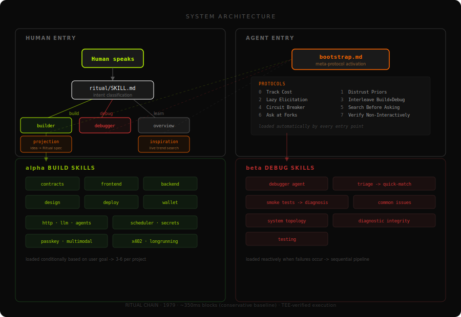
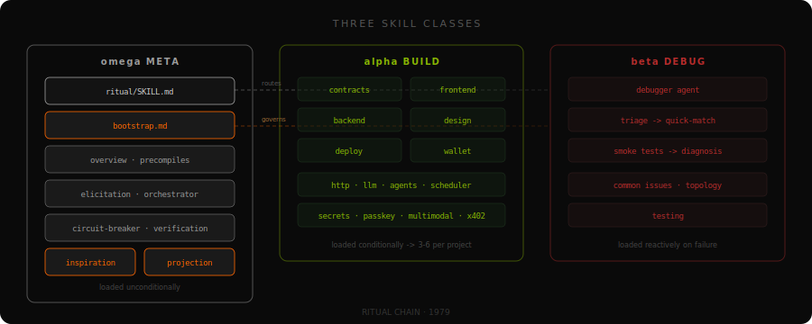

<p align="center">
  
</p>

<h1 align="center">ritual-dapp-skills</h1>

<p align="center">
  <strong>Skills and agents that teach AI coding assistants how to build dApps on Ritual.</strong>
</p>

<p align="center">
  <a href="https://skills.ritualfoundation.org"></a>
  <a href="https://github.com/ritual-foundation/ritual-dapp-skills"></a>
  
  
  
  
  
</p>

---

## Quick Start

```bash
# Claude Code
git clone https://github.com/ritual-foundation/ritual-dapp-skills.git .claude/skills/ritual-dapp-skills

# Then tell your agent:
Read the file skills/ritual/SKILL.md and follow its instructions.

WALLET: 0xYOUR_FUNDED_WALLET_ADDRESS_DAPP_CAN_BE_DEPLOYED_FROM

Build me a chatbot that runs on-chain with streaming responses.
```

For Cursor, OpenClaw, Hermes, and other harnesses, see the [microsite](https://skills.ritualfoundation.org).

---

## How It Works

The system has two entry points, three skill classes, and 10 behavioral protocols running as background middleware.

**You describe what you want.** The agent activates its behavioral protocols, loads the right skills, builds in phases, verifies each phase, and debugs automatically.

### Entry Points

| Entry                                   | Who   | What It Does                                                                                                                                  |
| --------------------------------------- | ----- | --------------------------------------------------------------------------------------------------------------------------------------------- |
| `skills/ritual/SKILL.md`                | Human | Classifies intent (build / debug / learn), runs inspiration if no idea, runs projection to map idea to precompiles, routes to the right agent |
| `skills/ritual-meta-bootstrap/SKILL.md` | Agent | Activates 10 behavioral rules as invisible middleware for the entire session                                                                  |

### Three Skill Classes



**Ω Meta** — Loaded unconditionally. 10 behavioral rules, inspiration (JIT idea generation from live trends), projection (idea-to-Ritual-spec transformation), verification (per-skill checks + 12-step E2E journey).

**α Build** — Feature skills loaded conditionally per the user's goal. The builder agent selects 3-6 per project. Phased execution: architecture → contracts → frontend → backend → testing → deploy.

**β Debug** — Diagnostic skills loaded reactively. Sequential pipeline: triage → smoke tests → quick-match 10 known root causes → systematic diagnosis → fix + verify.

### 10 Behavioral Rules

| #   | Rule                       | Purpose                                                  |
| --- | -------------------------- | -------------------------------------------------------- |
| 1   | Track Cost                 | Turn budget governs all thresholds                       |
| 2   | Distrust Priors            | Ritual violates Ethereum assumptions. No Infernet.       |
| 3   | Lazy Elicitation           | 0-5 JIT questions, never a static form                   |
| 4   | Interleave Build+Debug     | Verify after every irreversible action                   |
| 5   | Circuit Breaker            | Detect trajectory divergence, stop before wasting budget |
| 6   | Search Before Asking       | Exhaust 5-step resolution hierarchy first                |
| 7   | Ask at Forks               | Only for expensive preference-based forks                |
| 8   | Anti-Slop                  | Dimensional decomposition for UI artifacts               |
| 9   | Verify Non-Interactively   | Per-skill checks + 12-step E2E journey                   |
| 10  | Scope to Project Directory | All writes within project root, no cross-pollution       |

---

## Agents

| Agent                    | Purpose                                                                                                                              | Activation                                                      |
| ------------------------ | ------------------------------------------------------------------------------------------------------------------------------------ | --------------------------------------------------------------- |
| **ritual-dapp-builder**  | End-to-end dApp development: projection → architecture → contracts → frontend → backend → testing → deploy → post-build verification | User describes what they want to build                          |
| **ritual-dapp-debugger** | Diagnose and fix Ritual-specific issues: stuck transactions, missing callbacks, empty receipts, encoding mismatches                  | User reports a problem, or builder detects a failure post-build |

---

## Skills

### Meta Protocols (Ω)

| Skill                              | Purpose                                                               |
| ---------------------------------- | --------------------------------------------------------------------- |
| `ritual-meta-bootstrap`            | 10 behavioral rules as background middleware                          |
| `ritual-meta-inspiration`          | JIT idea generation from live blockchain + AI trends                  |
| `ritual-meta-projection`           | Transform raw ideas into Ritual-native specs with precompile mappings |
| `ritual-meta-elicitation`          | Lazy goal-state variance reduction (0-5 contextual questions)         |
| `ritual-meta-orchestrator`         | Build-debug interleaving with 4 principles                            |
| `ritual-meta-circuit-breaker`      | Trajectory divergence detection                                       |
| `ritual-meta-human-in-loop`        | Mid-session fork elicitation                                          |
| `ritual-meta-non-interactive-bias` | Search before asking                                                  |
| `ritual-meta-verification`         | Per-skill checks, cross-skill integration, 12-step E2E journey        |

### Architecture & Reference (Ω)

| Skill                     | What It Teaches                                                                                                                                |
| ------------------------- | ---------------------------------------------------------------------------------------------------------------------------------------------- |
| `ritual-dapp-overview`    | Chain architecture, TEE-EOVMT, non-deterministic computation, 3 execution models, 9-state async lifecycle, sequencing rights, system contracts |
| `ritual-dapp-precompiles` | All 16 precompile ABIs with field counts, Solidity + viem encoding examples                                                                    |
| `ritual-dapp-deploy`      | Chain config (ID 1979, testnet), Foundry/Hardhat setup, deployment scripts, faucet                                                             |
| `ritual-dapp-design`      | Dark-mode terminal aesthetic, typography, color semantics, WCAG 2.1 AA                                                                         |

### Precompile Features (α)

| Skill                     | Precompile                                                                     | Execution Model                   |
| ------------------------- | ------------------------------------------------------------------------------ | --------------------------------- |
| `ritual-dapp-http`        | HTTP (0x0801)                                                                  | Short-running async               |
| `ritual-dapp-llm`         | LLM (0x0802) + SSE streaming                                                   | Short-running async               |
| `ritual-dapp-agents`      | Persistent Agent (0x0820), Sovereign Agent (0x080C)                            | Long-running async (callback)     |
| `ritual-dapp-longrunning` | Long HTTP (0x0805)                                                             | Long-running async (poll/deliver) |
| `ritual-dapp-multimodal`  | Image (0x0818), Audio (0x0819), Video (0x081A)                                 | Long-running async (callback)     |
| `ritual-dapp-onnx`        | ONNX ML inference (0x0800)                                                     | Synchronous                       |
| `ritual-dapp-ed25519`     | Ed25519 signature verification (0x0009)                                        | Synchronous                       |
| `ritual-dapp-scheduler`   | Scheduler system contract + predicates                                         | Scheduled execution               |
| `ritual-dapp-secrets`     | ECIES encryption, SECRET_NAME string replacement, PII redaction, delegated ACL | Cross-cutting                     |
| `ritual-dapp-x402`        | X402 micropayments via HTTP                                                    | Pay-per-call APIs                 |
| `ritual-dapp-passkey`     | SECP256R1 (0x0100) + TxPasskey (0x77)                                          | Synchronous                       |

### Smart Contracts (α)

| Skill                   | What It Teaches                                                                       |
| ----------------------- | ------------------------------------------------------------------------------------- |
| `ritual-dapp-contracts` | Consumer patterns: sync, short-running decoding, long-running callbacks, auth, events |
| `ritual-dapp-wallet`    | RitualWallet deposit/lock/withdraw, fee estimation, emergency withdrawal              |

### Full-Stack (α)

| Skill                  | What It Teaches                                                                     |
| ---------------------- | ----------------------------------------------------------------------------------- |
| `ritual-dapp-frontend` | Next.js + wagmi, 9-state async TX machine, spcCalls parsing, SSE streaming          |
| `ritual-dapp-backend`  | Event indexer, AsyncJobTracker watcher, sender lock serialization, health endpoints |
| `ritual-dapp-testing`  | Foundry unit/fuzz/fork, vm.mockCall for precompiles, Vitest, Playwright E2E         |

---

## Build Execution Trace

When you say "build me X," the agent reads files in this order:

| Step | File                                                                          | Purpose                                |
| ---- | ----------------------------------------------------------------------------- | -------------------------------------- |
| 1    | `skills/ritual-meta-projection/SKILL.md`                                      | Transform idea into Ritual-native spec |
| 2    | `agents/ritual-dapp-builder.md`                                               | Phased build protocol                  |
| 3    | `examples/registry.json`                                                      | Reference contracts on Ritual Chain    |
| 4    | `skills/ritual-dapp-overview/SKILL.md`                                        | Chain architecture                     |
| 5    | `skills/ritual-dapp-precompiles/SKILL.md`                                     | ABI reference                          |
| 6+   | Feature skills based on selected precompiles                                  | Per-feature patterns                   |
| 7+   | `contracts`, `wallet`, `frontend`, `design`, `deploy`, `testing`              | Phase-specific skills                  |
| Last | `agents/ritual-dapp-debugger.md` + `skills/ritual-meta-verification/SKILL.md` | Post-build verification                |

Progress is checkpointed to `.ritual-build/progress.json` after each phase.

---

## Works With

| Harness             | Integration                                                      |
| ------------------- | ---------------------------------------------------------------- |
| **Claude Code**     | Drop `skills/` into agent skill path. Native `SKILL.md` format.  |
| **Cursor**          | Add to `.cursor/rules/` or reference as agent skills             |
| **OpenClaw**        | Drop `skills/` into agent skill path. Native `SKILL.md` format.  |
| **Hermes Agent**    | Copy to `skills/blockchain/ritual/` or sync via `skills_sync.py` |
| **Codex / ChatGPT** | Point system prompt at `skills/ritual/SKILL.md`                  |

### Recommended Combinations

- **Claude Code + Opus 4.7 Max**
- **Cursor + Codex 5.3 Extra High**

Other combinations work but your mileage may vary.

---

## Chain Reference

| Property        | Value                                   |
| --------------- | --------------------------------------- |
| Chain ID        | `1979`                                  |
| Currency        | RITUAL (18 decimals, testnet)           |
| Block time      | ~350ms (conservative baseline)          |
| RPC (HTTP)      | `https://rpc.ritualfoundation.org`      |
| RPC (WebSocket) | `wss://rpc.ritualfoundation.org/ws`     |
| Explorer        | `https://explorer.ritualfoundation.org` |

| System Contract      | Address                                      |
| -------------------- | -------------------------------------------- |
| RitualWallet         | `0x532F0dF0896F353d8C3DD8cc134e8129DA2a3948` |
| AsyncJobTracker      | `0xC069FFCa0389f44eCA2C626e55491b0ab045AEF5` |
| TEEServiceRegistry   | `0x9644e8562cE0Fe12b4deeC4163c064A8862Bf47F` |
| Scheduler            | `0x56e776BAE2DD60664b69Bd5F865F1180ffB7D58B` |
| SecretsAccessControl | `0xf9BF1BC8A3e79B9EBeD0fa2Db70D0513fecE32FD` |
| AsyncDelivery        | `0x5A16214fF555848411544b005f7Ac063742f39F6` |
| ModelPricingRegistry | `0x7A85F48b971ceBb75491b61abe279728F4c4384f` |

---

## Directory Structure

```
ritual-dapp-skills/
├── skills/
│   ├── ritual/                         # Ω — Human front door
│   ├── ritual-dapp-overview/           # Ω — Architecture + TEE-EOVMT
│   ├── ritual-dapp-precompiles/        # Ω — ABI reference (16 precompiles)
│   ├── ritual-dapp-deploy/             # α — Chain config + deployment
│   ├── ritual-dapp-design/             # α — Design system
│   ├── ritual-dapp-contracts/          # α — Solidity patterns
│   ├── ritual-dapp-wallet/             # α — Fee management
│   ├── ritual-dapp-http/               # α — HTTP precompile (0x0801)
│   ├── ritual-dapp-llm/                # α — LLM precompile (0x0802)
│   ├── ritual-dapp-agents/             # α — Agent precompiles (0x0820/0x080C)
│   ├── ritual-dapp-longrunning/        # α — Long-running HTTP (0x0805)
│   ├── ritual-dapp-multimodal/         # α — Image/Audio/Video (0x0818-0x081A)
│   ├── ritual-dapp-onnx/               # α — ONNX ML inference (0x0800)
│   ├── ritual-dapp-ed25519/            # α — Ed25519 verification (0x0009)
│   ├── ritual-dapp-scheduler/          # α — Scheduled operations
│   ├── ritual-dapp-secrets/            # α — Secret management + PII redaction
│   ├── ritual-dapp-x402/               # α — Micropayments
│   ├── ritual-dapp-passkey/            # α — Passkey authentication
│   ├── ritual-dapp-frontend/           # α — React/Next.js frontend
│   ├── ritual-dapp-backend/            # α — Backend services
│   ├── ritual-dapp-testing/            # α/β — Testing patterns
│   ├── ritual-meta-bootstrap/          # Ω — 10 behavioral rules
│   ├── ritual-meta-inspiration/        # Ω — JIT idea generation
│   ├── ritual-meta-projection/         # Ω — Idea → Ritual-native spec
│   ├── ritual-meta-elicitation/        # Ω — Lazy goal-state variance reduction
│   ├── ritual-meta-orchestrator/       # Ω — Build-debug interleaving
│   ├── ritual-meta-circuit-breaker/    # Ω — Trajectory divergence detection
│   ├── ritual-meta-human-in-loop/      # Ω — Mid-session fork elicitation
│   ├── ritual-meta-non-interactive-bias/ # Ω — Search before asking
│   └── ritual-meta-verification/       # Ω — Verification protocols
├── agents/
│   ├── ritual-dapp-builder.md          # α — Build orchestrator
│   ├── ritual-dapp-debugger.md         # β — Debug orchestrator
│   └── debugger-reference/             # β — Diagnostic pipeline
├── site/                               # Microsite (deployed to Cloud Run)
├── assets/                             # SVG diagrams
├── examples/
│   ├── persistent-agent/             # Persistent Agent (0x0820) e2e flow
│   ├── sovereign-agent/              # Sovereign Agent (0x080C) e2e flow
│   ├── README.md
│   └── registry.json
├── templates/
│   ├── nextjs-starter/
│   └── hardhat-starter/
└── scripts/
    ├── pull_contracts.py
```

---

## Scheduled Async Debugging Utilities

For scheduled/scheduled-async tracing, use the embedded runnable Python snippets in:
`agents/debugger-reference/scheduled-async-rpc-runbook.md`

That runbook includes:

- deterministic scheduled-hash derivation utility
- commitment-lookup utility from async origin hashes

---

<p align="center">
  <a href="https://docs.ritualfoundation.org">Docs</a> · <a href="https://explorer.ritualfoundation.org">Explorer</a> · <a href="https://skills.ritualfoundation.org">Microsite</a>
</p>
